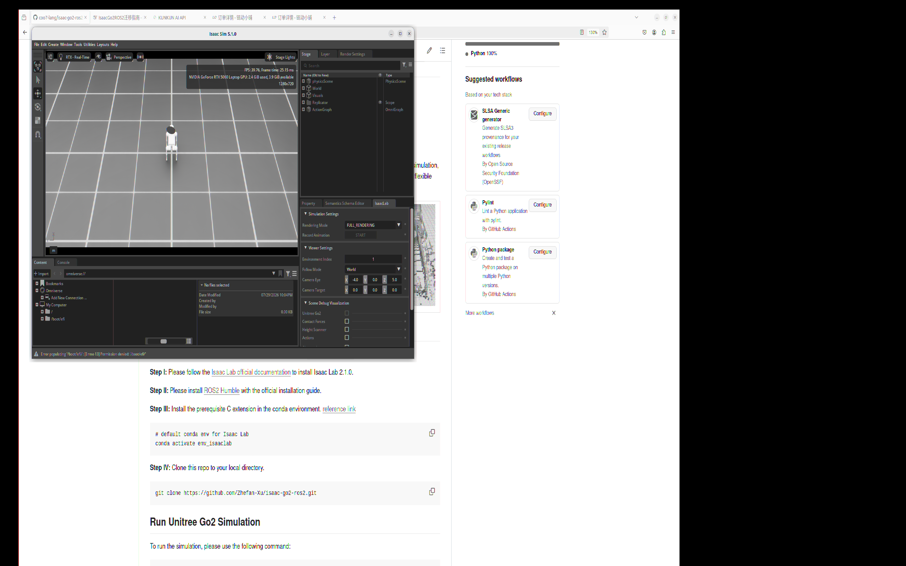
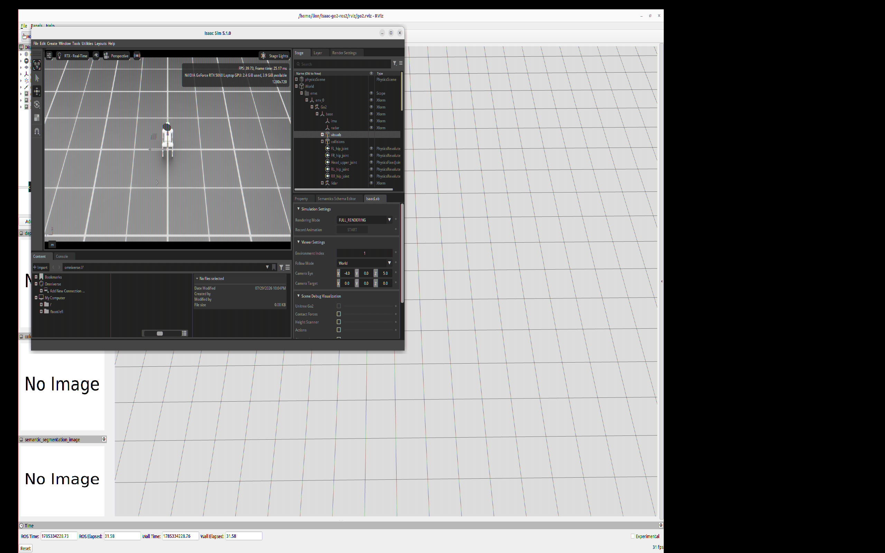
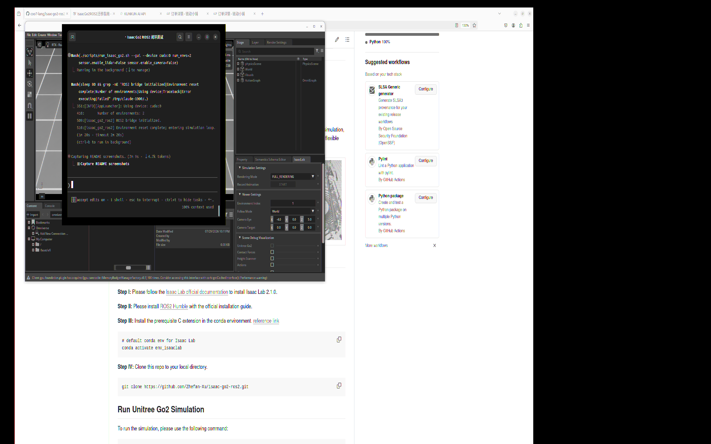

# Isaac Sim 5.1 版 Go2 ROS2 迁移说明

[](https://docs.python.org/3/whatsnew/3.11.html)
[](https://docs.ros.org/en/humble/index.html)
[](https://docs.isaacsim.omniverse.nvidia.com/5.1.0/index.html)
[](https://isaac-sim.github.io/IsaacLab/)
[](https://releases.ubuntu.com/22.04/)

这个分支是基于原项目 `isaac-go2-ros2` 做的本地环境适配版本，目标是在 Ubuntu 22.04 + Isaac Sim 5.1.0 + Isaac Lab 2.3.0 + ROS2 Humble + RTX 50 系显卡环境下，尽量保留原 `isaacsim-4.5` 分支的核心功能。

当前对应分支：

- `isaacsim-5.1`

原始参考分支：

- `isaacsim-4.5`

这份 README 更偏向迁移记录和阶段总结，主要用于说明这次适配做了什么、验证到了什么程度，以及和原分支相比有哪些差异。

## 迁移目标

本次迁移的目标不是简单把版本号改成 5.1，而是尽量保留原项目的核心仿真与 ROS2 bridge 能力，包括：

- 通过 `/unitree_go2/cmd_vel` 控制 Go2 运动
- 发布 `/odom`、`/pose`、`/tf`、`/clock`
- 发布 RGB、depth、semantic segmentation、LiDAR 等传感器话题
- 支持 RViz 可视化
- 支持多机器人启动
- 支持 GUI 与 headless 两种运行方式

## 已验证环境

本分支当前验证环境为：

- Ubuntu 22.04
- Isaac Sim 5.1.0
- Isaac Lab 2.3.0
- ROS2 Humble
- Isaac 进程 Python 3.11
- 系统 ROS2 Python 3.10
- 本地验证使用的 conda 环境名：`lab`

## 相比原 4.5 分支的主要改动

这次适配不是直接升级依赖，而是针对本机环境做了几类关键修改：

- 新增独立启动脚本 `scripts/run_isaac_go2.sh`
- 明确隔离 Isaac Python 3.11 与系统 ROS2 Humble Python 3.10
- 调整 headless 启动链路，避免系统 ROS Python 包污染 Isaac 进程
- 适配 Isaac Sim 5.1 下的 ROS2 bridge 扩展加载方式
- 适配 Isaac Sim 5.1 下 RTX LiDAR 的创建与点云提取逻辑
- 将相机、LiDAR、semantic 相关依赖改为按需导入，方便定位问题
- 更新 RViz 配置和传感器话题覆盖范围
- 增加当前验证结果对应的截图素材

## 当前功能状态

已经验证通过的内容：

- GUI 启动
- headless 启动
- 单机器人 `/cmd_vel`、`/odom`、`/pose`、`/tf`
- LiDAR 点云
- RGB 图像
- depth 图像
- CameraInfo
- semantic segmentation 图像
- semantic segmentation label 元数据
- `num_envs=2` 多机器人
- RViz 配置
- 原项目 7 个环境都能进入仿真循环
- 全传感器同时开启的启动路径

目前与原分支仍有差异的点：

- `/unitree_go2/front_cam/semantic_segmentation_image_vis` 没有在 Isaac 进程内稳定恢复
- 还没有重新接回 NavRL 或其他外部导航 demo
- 这条分支优先服务于当前本机环境，不是面向通用发布环境做的完整重构

## 最重要的环境规则

本分支最关键的一点是：

- Isaac Sim / Isaac Lab 运行在 Python 3.11
- 系统 ROS2 Humble 工具运行在 Python 3.10

因此不要在启动 Isaac 仿真的终端里先执行：

```bash
source /opt/ros/humble/setup.bash
```

这样会把 Python 3.10 的 ROS 包混入 Python 3.11 的 Isaac 进程，容易导致 `rclpy`、`cv_bridge` 或共享库 ABI 冲突。

推荐做法：

- Isaac 终端：只用项目启动脚本
- ROS2 终端：单独 `source /opt/ros/humble/setup.bash`

当前提交的启动脚本就是按这个原则写的。

## 推荐启动方式

推荐入口：

```bash
cd /home/lion/isaac-go2-ros2
./scripts/run_isaac_go2.sh --headless --device cuda:0
```

GPU + GUI 启动：

```bash
cd /home/lion/isaac-go2-ros2
./scripts/run_isaac_go2.sh --gui --device cuda:0 sensor.enable_lidar=False sensor.enable_camera=False
```

CPU headless smoke test：

```bash
cd /home/lion/isaac-go2-ros2
./scripts/run_isaac_go2.sh --headless --device cpu
```

全传感器启动：

```bash
cd /home/lion/isaac-go2-ros2
./scripts/run_isaac_go2.sh --gui --device cuda:0 --enable-cameras \
  env_name=warehouse \
  sensor.enable_lidar=True \
  sensor.enable_camera=True \
  sensor.color_image=True \
  sensor.depth_image=True \
  sensor.semantic_segmentation=True
```

成功启动时，日志中应出现：

```text
[isaac_go2_ros2] ROS2 bridge initialized.
[isaac_go2_ros2] Environment reset complete; entering simulation loop.
```

## ROS2 验证方式

在单独的 ROS2 终端中执行：

```bash
source /opt/ros/humble/setup.bash
export ROS_DOMAIN_ID=0
export RMW_IMPLEMENTATION=rmw_fastrtps_cpp
ros2 topic list
```

已验证的核心话题：

- `/unitree_go2/cmd_vel`
- `/unitree_go2/odom`
- `/unitree_go2/pose`
- `/tf`
- `/tf_static`
- `/clock`

已验证的相机相关话题：

- `/unitree_go2/front_cam/color_image`
- `/unitree_go2/front_cam/depth_image`
- `/unitree_go2/front_cam/semantic_segmentation_image`
- `/unitree_go2/front_cam/semantic_segmentation_label`
- `/unitree_go2/front_cam/info`

已验证的 LiDAR 话题：

- `/unitree_go2/lidar/point_cloud`

速度指令示例：

```bash
source /opt/ros/humble/setup.bash
export ROS_DOMAIN_ID=0
export RMW_IMPLEMENTATION=rmw_fastrtps_cpp
ros2 topic pub /unitree_go2/cmd_vel geometry_msgs/msg/Twist \
"{linear: {x: 0.3, y: 0.0, z: 0.0}, angular: {x: 0.0, y: 0.0, z: 0.0}}" --once
```

## RViz 与多机器人

RViz 启动方式：

```bash
source /opt/ros/humble/setup.bash
export ROS_DOMAIN_ID=0
export RMW_IMPLEMENTATION=rmw_fastrtps_cpp
rviz2 -d /home/lion/isaac-go2-ros2/rviz/go2.rviz
```

多机器人启动示例：

```bash
cd /home/lion/isaac-go2-ros2
./scripts/run_isaac_go2.sh --gui --device cuda:0 \
  num_envs=2 \
  sensor.enable_lidar=False \
  sensor.enable_camera=False
```

双机器人话题形式：

```text
/unitree_go2_0/cmd_vel
/unitree_go2_0/odom
/unitree_go2_0/pose
/unitree_go2_1/cmd_vel
/unitree_go2_1/odom
/unitree_go2_1/pose
```

## 当前已知限制

`semantic_segmentation_image_vis` 不是这次迁移中已稳定恢复的核心功能。

主要原因：

- Isaac Sim 5.1 进程使用 Python 3.11
- 本机 ROS2 Humble 的 `cv_bridge` 绑定在 Python 3.10 环境

当前做法：

- 保留 raw semantic ID image
- 保留 semantic label metadata
- 当 Python 3.11 环境下不可用 `cv_bridge` 时，不在 Isaac 进程内生成彩色 semantic 可视化图像

如果后续确实需要彩色 semantic 可视化，更合适的做法是单独写一个外部 ROS2 Humble 节点来完成，而不是继续塞进 Isaac 进程。

## 已验证场景

当前已验证可进入仿真循环的场景：

- `warehouse`
- `warehouse-forklifts`
- `warehouse-shelves`
- `full-warehouse`
- `obstacle-sparse`
- `obstacle-medium`
- `obstacle-dense`

示例：

```bash
./scripts/run_isaac_go2.sh --gui --device cuda:0 env_name=full-warehouse sensor.enable_lidar=False sensor.enable_camera=False
```

## 截图

Isaac Sim GUI：



RViz 全传感器：



多机器人：



## 关键文件

和这次迁移最相关的文件：

- `scripts/run_isaac_go2.sh`：适用于本机 Isaac Sim 5.1 / Isaac Lab 2.3 的安全启动脚本
- `isaac_go2_ros2.py`：主入口与运行时初始化
- `go2/go2_ctrl.py`：低层控制策略与 `/cmd_vel` 接口
- `go2/go2_sensors.py`：相机与 LiDAR 创建
- `ros2/go2_ros2_bridge.py`：ROS2 发布与订阅桥接
- `env/sim_env.py`：场景加载与 semantic 标注路径
- `rviz/go2.rviz`：当前验证通过的 RViz 配置

## 总结

从功能角度看，这条分支已经可以视为把原 `isaacsim-4.5` 分支的核心仿真与 ROS2 bridge 能力，迁移到了 Isaac Sim 5.1 / Isaac Lab 2.3 的本机环境中。

剩下更像发布前的收尾工作，而不是核心迁移未完成：

- README 继续精修
- 如果确实需要，再补外部 semantic 可视化节点
- 如果后续进入下一阶段，再接回 navigation / agent demo
